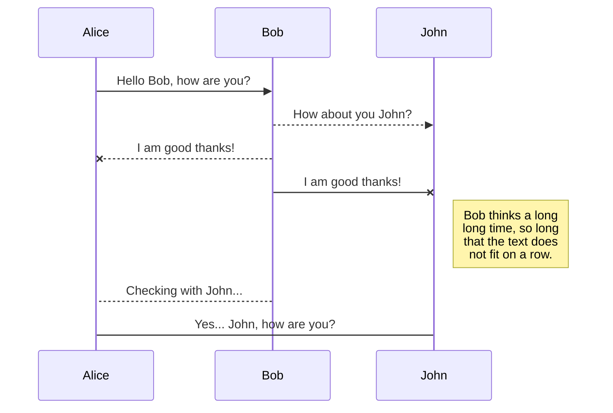
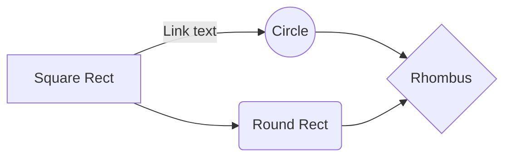

# Simple Shell


## Project Overview
La **simple shell**, es un proyecto para comprender como trabaja a nivel de maquina todo lo que sucede en el sistema operativo y su administración de recursos, dando una mayor conocimiento en como intereactua el hardware con su software gracias a su Kernel.

### What is your project all about?
Se trata de una terminal que en su ejecución carga una simple - shell que permite un manejo básico de algunos comandos de sistema 

### Who was it created for?
Fue creado por miembros de la cohorte 11 para presentar el proyecto final de Low-level programming.

### Why is it important to you?
La importancia de este proyecto es poner a prueba los conocimientos adquiridos durante el proceso de aprendizaje de Low-level programming.

### When was it created?
Fue creado a inicios de abril del 2020.

### Where can we find it live or the official documentation?
Los repositorios a este proyecto están publicados por parte de los autores en:
[https://github.com/d1sd41n/simple_shell](https://github.com/d1sd41n/simple_shell)

### How does one go about using it live or within their own project?
Para usarlo, descargue el repositorio y realice la compilación con la siguiente linea:
>  gcc -Wall -Werror -Wextra -pedantic *.c -o hsh

y luego ejecútelo con la siguiente linea:
> ./hsh

esto ejecutara la simple - shell mostrando el siguiente prompt:

>$>

ahora puede comenzar a ejecutar comandos basicos de manejo de esta simple - shell
 
### Configuration instructions
imágenes o paso a paso de como descargarlo y ejecutarlo.

### Installation instructions 
incluir otros software que necesita para poder ejecutar el proyecto

### Operating instructions
¿Qué es esto? ¿A dónde va esto? Ahora es el momento de desmitificar cualquier suposición sobre cómo usar su proyecto.

### Files included
cpath.c, linkedlist.c, _putchar.c, shell.c, _stringcomp.c, _getenv.c, _memcpy.c, _strcat.c,  _strlen.c, holberton.h, _printenv.c , README.md, _strdup.c, _strncmp.c .

dependiendo de qué tan grande sea su código fuente, puede optar por no incluir el árbol de archivos, sin embargo, aún puede explicar cómo recorrer su código. Por ejemplo, ¿cómo se modulariza su código? ¿Utilizaste el método MVC (Modelo, Vista, Controlador)? ¿Utilizaste un sistema de enrutador? Solo algunas preguntas para considerar al detallar la estructura de su archivo.

### Copyright and licensing information
Default copyright laws will apply and you will retain all rights to your source code and no one may reproduce, distribute, or create derivative works from your work. Hence the reason licenses are critical and highly recommended for open source projects.

### Contact information for the distributor or programmer
Name, email, social media links, and any other helpful ways of getting in contact with you or members of your team.

### Known bugs
Aun no se han definido errores pero estamos receptivos a la mejora continua del proyecto.

### Troubleshooting
Si eres programador o estudiante esta en tus manos las mejoras que desees al proyecto, teniendo en cuenta la licencia de esta creación y dando a conocer el recurso base donde los has adquirido.

### Credits and acknowledgments
Los creadores de este proyecto son:
_ Daniel Perez, Roger Rendon _
(links de consulta o videos que ayudaron al proyecto.)

### Changelog (usually for programmers)
Cambios realizados al proyecto, ninguno hasta el momento registrado.

### News section (usually for users)
Hola, los escuchamos, los apreciamos y por su Los comentarios aquí son los cambios más recientes, las actualizaciones y las nuevas funciones realizadas .


# Ejemplo de titulo N1
## Ejemplo de subtitulo N2
### Ejemplo de subtitulo de subtitulo N3
#### Ejemplo de subtitulo de subtitulo N4
##### Ejemplo de subtitulo de subtitulo N5
###### Ejemplo de subtitulo de subtitulo N6

Subrayado y titulo grande 
======  
Subrayado y titulo medio  
------
- Viñetas
- Viñetas
  > Para explicaciones encerradas en linea .

## Ejemplo de Codigo


```sh
FORMAT =>	REPLACED
%i => replaced an integer variable
%d => repalced an decimal base 10
%c => replaced an character variable
%s => replaced a pointer char variable
%% => replaced by a single percent symbol
```

```sh
check_type.c
holberton.h
man_3_printf
print_c.c
print_di.c
_printf.c
print_number.c
print_s.c
_putchar.c
README.md
```

1. First ordered list item  
2. Another item  
 
* Unordered list can use asterisks  
- Or minuses  
+ Or pluses


**Para las negritas**

> **Ejemplo de Nota:** para poder hacer una explicación mas **no olvidar negritas** para enfatizar.

# Publication
para colocer lo escrito en link [palabra en link](http://direccion requerida.com/), para ser mas cool.


## Recuadros

ejemplo:
|                |ASCII                          |HTML                         |
|----------------|-------------------------------|-----------------------------|
|Single backticks|`'Isn't this fun?'`            |'Isn't this fun?'            |
|Quotes          |`"Isn't this fun?"`            |"Isn't this fun?"            |
|Dashes          |`-- is en-dash, --- is em-dash`|-- is en-dash, --- is em-dash|

## diagramas UML

para mejorar la idea ir a [Mermaid](https://mermaidjs.github.io/). para mas ejemplos



And this will produce a flow chart:



https://stackedit.io/app#
